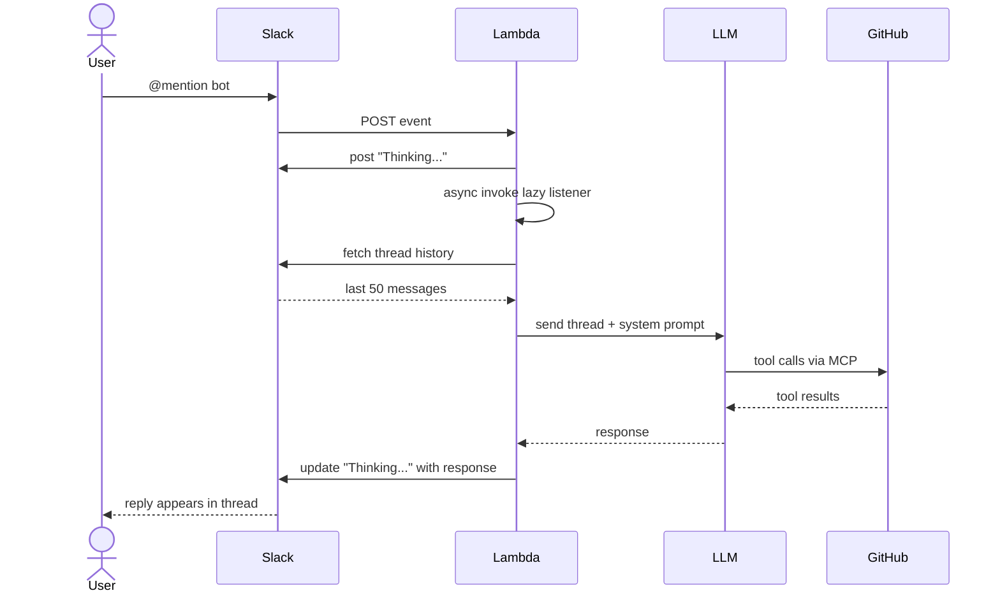

# Slack Bot

@mention the bot in any channel or thread and it replies using Claude Sonnet 4.6 connected to the GitHub MCP server. Posts a "Thinking..." message immediately while the LLM runs, then edits it in place with the response. Reads the last 50 messages of thread history for context. All incoming requests are verified against Slack's signing secret.

## Architecture



## How it works

Built on the [Slack Bolt](https://slack.dev/bolt-python/) framework using its **lazy listener** pattern for AWS Lambda.

When an `@mention` arrives, Lambda must respond to Slack within 3 seconds or Slack will retry. To handle this, the first invocation posts "Thinking..." and immediately returns `200`, then re-invokes itself asynchronously to do the slow work.

The second invocation fetches the last 50 messages of thread history, sends them to Claude Sonnet 4.6 with access to the GitHub MCP server, and edits the "Thinking..." message in place with the response.

The bot responds to **@mentions** in channels and threads. DMs are handled separately.

## Demo


## Prerequisites

- AWS CLI configured (`aws configure`)
- Docker
- [uv](https://docs.astral.sh/uv/) (for dependency management)
- Slack app (see Configure Slack below)
- Anthropic API key
- GitHub personal access token

## Configure Slack

### 1. Create a Slack app

Go to [api.slack.com/apps](https://api.slack.com/apps) → **Create New App** → **From a manifest** → paste `manifest.json`

Or manually:

### 2. Add Bot Token Scopes

**OAuth & Permissions** → **Bot Token Scopes**:

| Scope | Purpose |
|---|---|
| `app_mentions:read` | Receive @mention events |
| `channels:history` | Read messages in public channels |
| `chat:write` | Post and edit messages |
| `im:history` | Read direct messages |
| `im:write` | Post DM replies |
| `groups:history` | Read messages in private channels |
| `reactions:write` | Add emoji reactions |

### 3. Enable Event Subscriptions

**Event Subscriptions** → toggle **On** → paste your API Gateway URL as the Request URL.

Under **Subscribe to bot events** add:
- `app_mention`
- `message.channels`
- `message.im`
- `message.groups`
- `app_home_opened`

### 4. Enable Interactivity

**Interactivity & Shortcuts** → toggle **On** → paste the same API Gateway URL.

### 5. Install the app

**OAuth & Permissions** → **Install to Workspace** → copy the **Bot User OAuth Token** (`xoxb-...`)

### 6. Copy credentials

- **Bot Token** (`xoxb-...`): OAuth & Permissions
- **Signing Secret**: Basic Information → App Credentials
- **Anthropic API key**: [console.anthropic.com](https://console.anthropic.com)
- **GitHub token**: GitHub → Settings → Developer settings → Personal access tokens

### 7. Add bot to a channel

In Slack: `/invite @your-bot-name`

## Deploy

### 1. Create ECR repository

```bash
aws ecr create-repository --repository-name slack-lambda
```

### 2. Build and push image

```bash
aws ecr get-login-password --region us-east-1 | docker login --username AWS \
  --password-stdin <account-id>.dkr.ecr.us-east-1.amazonaws.com

docker build --platform linux/amd64 -t slack-lambda .
docker tag slack-lambda:latest <account-id>.dkr.ecr.us-east-1.amazonaws.com/slack-lambda:latest
docker push <account-id>.dkr.ecr.us-east-1.amazonaws.com/slack-lambda:latest
```

### 3. Deploy the CloudFormation stack

```bash
aws cloudformation deploy \
  --template-file template.yaml \
  --stack-name slack-lambda \
  --capabilities CAPABILITY_NAMED_IAM \
  --parameter-overrides \
    ImageUri=<account-id>.dkr.ecr.us-east-1.amazonaws.com/slack-lambda:latest \
    SlackBotToken=xoxb-... \
    AnthropicApiKey=sk-ant-... \
    GitHubToken=github_pat_... \
    SlackSigningSecret=your-signing-secret
```

### 4. Get the API Gateway URL

```bash
aws cloudformation describe-stacks \
  --stack-name slack-lambda \
  --query "Stacks[0].Outputs[?OutputKey=='ApiEndpoint'].OutputValue" \
  --output text
```

Paste this URL as the **Request URL** in Slack Event Subscriptions and Interactivity.

## Redeploy after code changes

```bash
aws ecr get-login-password --region us-east-1 | docker login --username AWS \
  --password-stdin <account-id>.dkr.ecr.us-east-1.amazonaws.com

docker build --platform linux/amd64 -t slack-lambda .
docker tag slack-lambda:latest <account-id>.dkr.ecr.us-east-1.amazonaws.com/slack-lambda:latest
docker push <account-id>.dkr.ecr.us-east-1.amazonaws.com/slack-lambda:latest

aws lambda update-function-code \
  --function-name slack-bolt-handler \
  --image-uri <account-id>.dkr.ecr.us-east-1.amazonaws.com/slack-lambda:latest
```

## Environment Variables

| Variable | Description |
|---|---|
| `SLACK_BOT_TOKEN` | Bot User OAuth Token (`xoxb-...`) |
| `SLACK_SIGNING_SECRET` | Slack app signing secret |
| `ANTHROPIC_API_KEY` | Anthropic API key |
| `GITHUB_TOKEN` | GitHub personal access token |

## Local development

Use the Lambda container locally with the AWS Lambda Runtime Interface Emulator:

```bash
docker build --platform linux/amd64 -t slack-lambda .
docker run -p 9000:8080 \
  -e SLACK_BOT_TOKEN=xoxb-... \
  -e SLACK_SIGNING_SECRET=... \
  -e ANTHROPIC_API_KEY=sk-ant-... \
  -e GITHUB_TOKEN=github_pat_... \
  slack-lambda
```

Invoke the function locally:

```bash
curl -X POST http://localhost:9000/2015-03-31/functions/function/invocations \
  -d '{"body": "..."}'
```

## Teardown

```bash
aws cloudformation delete-stack --stack-name slack-lambda
aws ecr delete-repository --repository-name slack-lambda --force
```
