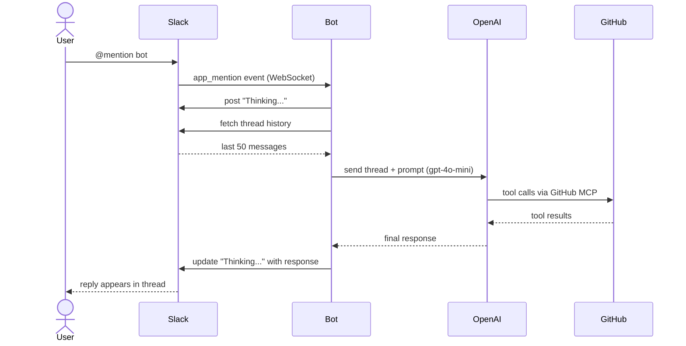
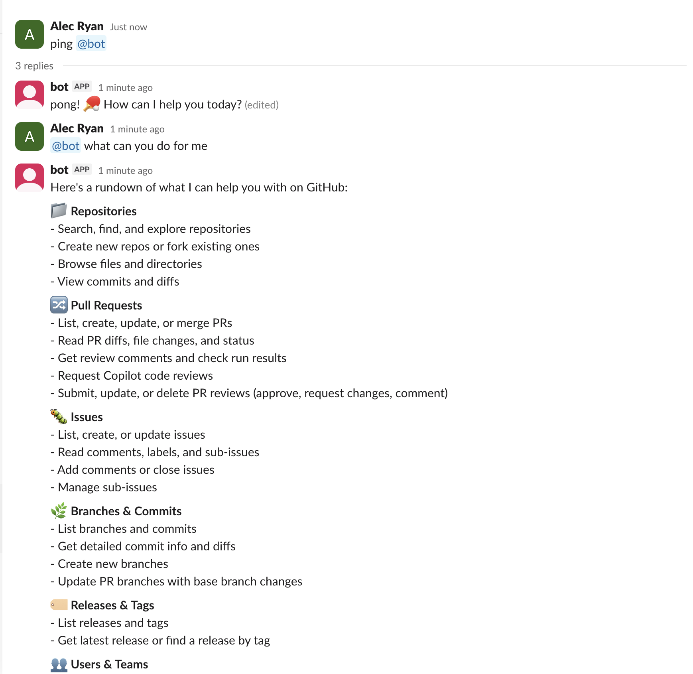

# Slack Bot

@mention the bot in any channel or thread and it replies using GPT-4o Mini connected to the GitHub MCP server. Posts a "Thinking..." message immediately while the model runs, then edits it in place with the response. Reads the last 50 messages of thread history for context.

## Architecture



## How it works

Built on [Slack Bolt](https://slack.dev/bolt-python/) using **Socket Mode** — the bot maintains a persistent WebSocket connection to Slack rather than exposing an HTTP endpoint.

When an `@mention` arrives, the handler immediately acknowledges the event (satisfying Slack's 3-second requirement), posts "Thinking...", then synchronously:

1. Fetches the last 50 messages of the thread for context
2. Strips the `@mention` token from the user's message
3. Sends the prompt + thread context to GPT-4o Mini via the `openai-agents` SDK
4. The agent connects to the GitHub MCP server (`https://api.githubcopilot.com/mcp/`) and may make up to 50 tool calls
5. Edits the "Thinking..." message in-place with the final response

The bot responds to `@mentions` in channels and threads. If mentioned without any text, it prompts the user to try again with a message.

## Code structure

```
handler.py                        # Entrypoint — initializes Bolt app and starts Socket Mode
listeners/
  __init__.py                     # Registers all listeners with the app
  events/
    app_mentioned.py              # Handles app_mention events
  utils/
    parse_conversation.py         # Formats thread messages into [{user, text}] context
    constants.py                  # Loading text, fallback response strings
ai/
  agent.py                        # Runs the openai-agents agent with GitHub MCP
  constants.py                    # System prompt (Slack mrkdwn formatting instructions)
```

## Prerequisites

- Python 3.11+
- [uv](https://docs.astral.sh/uv/) (dependency management)
- Docker (optional, for containerized runs)
- Slack app (see Configure Slack below)
- OpenAI API key
- GitHub personal access token

## Configure Slack

### 1. Create a Slack app

Go to [api.slack.com/apps](https://api.slack.com/apps) → **Create New App** → **From a manifest** → paste `manifest.json`

### 2. Install the app

**OAuth & Permissions** → **Install to Workspace** → copy the **Bot User OAuth Token** (`xoxb-...`)

### 3. Generate an App-Level Token

**Basic Information** → **App-Level Tokens** → **Generate Token and Scopes** → add the `connections:write` scope → copy the token (`xapp-...`)

### 4. Copy credentials

| Credential | Where to find it |
|---|---|
| **Bot Token** (`xoxb-...`) | OAuth & Permissions |
| **App Token** (`xapp-...`) | Basic Information → App-Level Tokens |
| **Signing Secret** | Basic Information → App Credentials |
| **OpenAI API key** | [platform.openai.com/api-keys](https://platform.openai.com/api-keys) |
| **GitHub token** | GitHub → Settings → Developer settings → Personal access tokens |

### 5. Add bot to a channel

In Slack: `/invite @Bolty`

## Environment variables

Create a `.env` file at the project root:

```
SLACK_BOT_TOKEN=xoxb-...
SLACK_APP_TOKEN=xapp-...
OPENAI_API_KEY=sk-...
GITHUB_TOKEN=github_pat_...
```

| Variable | Description |
|---|---|
| `SLACK_BOT_TOKEN` | Bot User OAuth Token (`xoxb-...`) |
| `SLACK_APP_TOKEN` | App-Level Token for Socket Mode (`xapp-...`) |
| `OPENAI_API_KEY` | OpenAI API key |
| `GITHUB_TOKEN` | GitHub personal access token |

## Local development

**Install dependencies:**

```bash
uv sync
```

**Run the bot:**

```bash
source .venv/bin/activate
python handler.py
```

Or with Docker:

```bash
docker build --platform linux/amd64 -t slack-bot .
docker run --env-file .env slack-bot
```

## Demo



## Infrastructure

`template.yaml` defines a CloudFormation stack (Lambda + API Gateway) for a serverless deployment variant. Note that `handler.py` currently runs in Socket Mode — adapting to Lambda requires adding a `SlackRequestHandler` from `slack_bolt.adapter.aws_lambda`.

The current Socket Mode setup is simpler to run and sufficient for most use cases. Socket Mode does not require a public HTTP endpoint.
