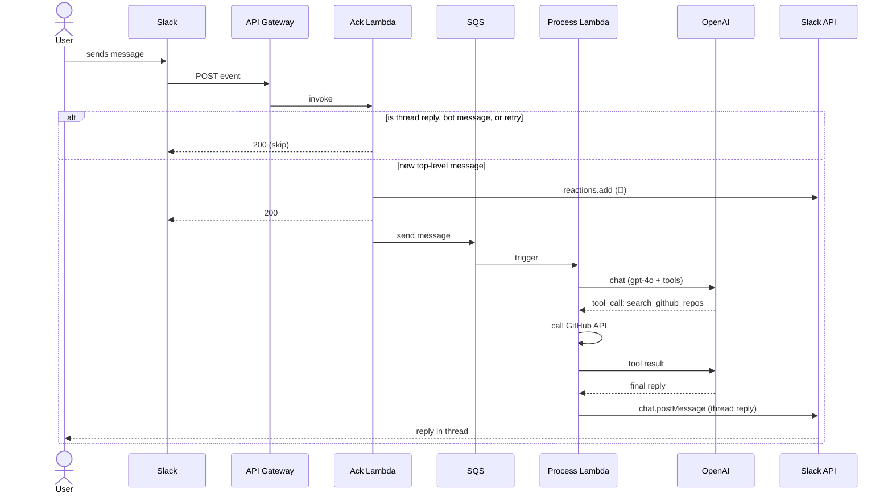

# Slack Bot

Receives Slack messages, reacts with 👀, and replies in-thread using GPT-4o with GitHub repo search tool calling.

## Architecture



## How it works

When a user sends a message in a Slack channel, Slack POSTs the event to an API Gateway endpoint. The **Ack Lambda** receives it, immediately reacts with 👀 to signal the message was received, and returns a `200` to Slack — all within the 3-second window Slack requires. It then drops the message onto an **SQS queue** and exits.

The **Process Lambda** is triggered by SQS and handles the slow work. It sends the message to **GPT-4o** along with a `search_github_repos` tool definition. If GPT decides a GitHub search is needed, it returns a tool call with a query — the Lambda executes the GitHub API request, feeds the results back to GPT, and GPT generates a final response. The reply is posted back to Slack as a thread reply on the original message.

The reason we split into two Lambdas is Slack's retry behavior — if Slack doesn't receive a `200` within 3 seconds, it assumes the request failed and retries the event. If we processed the LLM call in the same Lambda that acks Slack, a slow LLM response would trigger retries and the same message would be processed multiple times. By returning `200` immediately and offloading to SQS, we prevent duplicate processing.

## Demo


## Prerequisites

- AWS CLI configured (`aws configure`)
- Docker
- Slack app (see Configure Slack below)
- OpenAI API key
- GitHub personal access token (read-only, public repos)

## Configure Slack

### 1. Create a Slack app

Go to [api.slack.com/apps](https://api.slack.com/apps) → **Create New App** → **From scratch**

### 2. Add Bot Token Scopes

**OAuth & Permissions** → **Bot Token Scopes**:

| Scope | Purpose |
|---|---|
| `channels:history` | Read messages in public channels |
| `im:history` | Read direct messages |
| `chat:write` | Post replies in threads |
| `reactions:write` | Add 👀 reaction to messages |

### 3. Install the app

**OAuth & Permissions** → **Install to Workspace** → copy the **Bot User OAuth Token** (`xoxb-...`)

### 4. Enable Event Subscriptions

**Event Subscriptions** → toggle **On** → paste your API Gateway URL as the Request URL.

Under **Subscribe to bot events** add:
- `message.channels`
- `message.im` (optional, for DMs)

### 5. Add bot to a channel

In Slack: `/invite @your-bot-name`

## Deploy

### 1. Create ECR repository

```bash
aws ecr create-repository --repository-name slack-lambda
```

### 2. Build and push image

```bash
aws ecr get-login-password --region us-east-1 | docker login --username AWS \
  --password-stdin <account-id>.dkr.ecr.us-east-1.amazonaws.com

docker build --platform linux/amd64 -t slack-lambda .
docker tag slack-lambda:latest <account-id>.dkr.ecr.us-east-1.amazonaws.com/slack-lambda:latest
docker push <account-id>.dkr.ecr.us-east-1.amazonaws.com/slack-lambda:latest
```

### 3. Deploy the CloudFormation stack

```bash
aws cloudformation deploy \
  --template-file template.yaml \
  --stack-name slack-lambda \
  --capabilities CAPABILITY_NAMED_IAM \
  --parameter-overrides \
    ImageUri=<account-id>.dkr.ecr.us-east-1.amazonaws.com/slack-lambda:latest \
    SlackBotToken=xoxb-... \
    OpenAIApiKey=sk-... \
    GitHubToken=github_pat_...
```

### 4. Get the API Gateway URL

```bash
aws cloudformation describe-stacks \
  --stack-name slack-lambda \
  --query "Stacks[0].Outputs[?OutputKey=='ApiEndpoint'].OutputValue" \
  --output text
```

Paste this URL as the **Request URL** in Slack Event Subscriptions.

## Redeploy after code changes

```bash
aws ecr get-login-password --region us-east-1 | docker login --username AWS \
  --password-stdin <account-id>.dkr.ecr.us-east-1.amazonaws.com

docker build --platform linux/amd64 -t slack-lambda .
docker tag slack-lambda:latest <account-id>.dkr.ecr.us-east-1.amazonaws.com/slack-lambda:latest
docker push <account-id>.dkr.ecr.us-east-1.amazonaws.com/slack-lambda:latest

# Update both Lambdas
aws lambda update-function-code \
  --function-name slack-ack-handler \
  --image-uri <account-id>.dkr.ecr.us-east-1.amazonaws.com/slack-lambda:latest

aws lambda update-function-code \
  --function-name slack-process-handler \
  --image-uri <account-id>.dkr.ecr.us-east-1.amazonaws.com/slack-lambda:latest
```

## Environment Variables

| Variable | Lambda | Description |
|---|---|---|
| `SLACK_BOT_TOKEN` | Both | Bot User OAuth Token (`xoxb-...`) |
| `SQS_QUEUE_URL` | Ack | URL of the SQS queue |
| `OPENAI_API_KEY` | Process | OpenAI API key |
| `GITHUB_TOKEN` | Process | GitHub personal access token |

## Teardown

```bash
aws cloudformation delete-stack --stack-name slack-lambda
aws ecr delete-repository --repository-name slack-lambda --force
```
